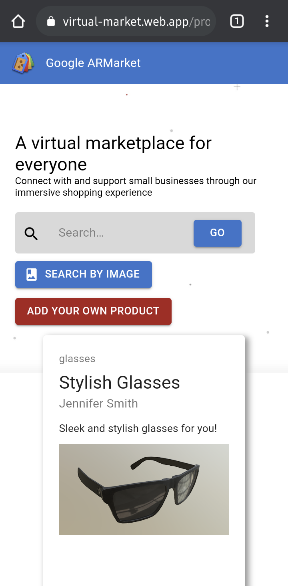
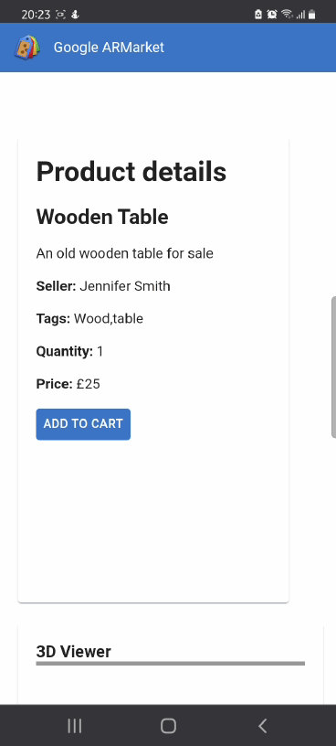
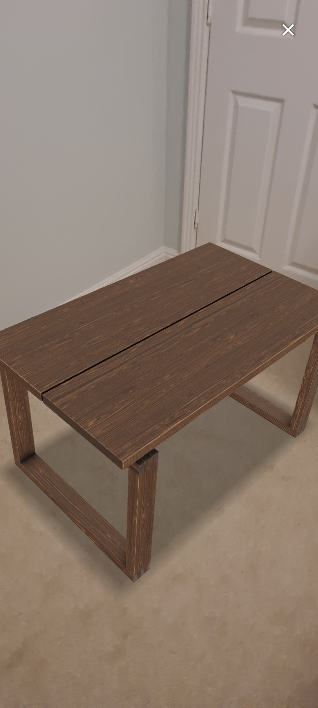

# BGN21: Team pARception

Check our cute pics at the bottom of the readme 😜

## Intro
At pARception, we believe that AR is the next tech revolution of our era. Our mission is to try and level the playing field by making the technologies and services used by big players more accessible for all.

Figures show that 20% of small businesses will fail in their first year and 60% not making it past year 3. This problem has also been amplified during the COVID 19 pandemic. These facts are what led us to create a web app which will help remedy some of the key issues exacerbated in this current climate.

During the pandemic, smaller businesses and individuals struggled to keep up with the pace of the ever growing bigger companies. For sellers - businesses existing before the pandemic as well as newly established ones or those who simply want to sell their crafts - lack of advertising, financial and technical capabilities combined with no footfall on the high streets, means it’s more difficult for them to compete with large corporations. For buyers who want something new, or purely to support local businesses, it has been a lot harder to use local businesses without being able to see or try their products in person. 
All of this leads to buyers finding themselves shopping at larger retailers like Amazon or IKEA that they already know.

Our solution changes the game and allows us to bring the stores to our buyers’ front door.

This is where Google ARMarket comes in. Two users are involved in the marketplace: the seller and the buyer, you! In addition to common online shops features, Google ARMarket offers two main breakthroughs for small businesses using Cloud Vision and AR capabilities. For sellers who would partner with us, their products can be viewed from all angles and even tested in the buyer's home, and for buyers using it, they’ll have more confidence in buying them. Also, smart search can match details of their products using comp vision which also lets buyers get better matches when they search even if they can’t find the right words. Result? Happier shopping for all.

## Features
Onto the demo! First, the instant image search. Buyers often struggle to input the correct keywords to match a product they would like to buy, therefore missing out on potential matching sellers. Instant image search allows buyers to upload an image of what they're interested in buying looks like (say, a green t-shirt with a yellow circle), and Google Marketplace will pair them with the most matching sellers. This also means that users looking to be more sustainable and local-business friendly can take screenshots of products they’re interested in on larger sites (e.g. Amazon) and use the instant image search to find similar products from local stores, further promoting the businesses on our platform.

Second, the Augmented Reality (AR) viewer. Often small businesses or starters involve many handcrafted products (paintings, pottery, necklaces, bracelets, custom tables...) and buyers often struggle to identify fully what the product looks like from just images, therefore reducing their trust in the product and limiting the buying flow. Google Marketplace incorporates an AR platform, where sellers can optionally scan an upload 3D models from their phones without prior technical expertise, maximizing their chances of selling their products and giving buyers an immersive experience in our app.

## Tech stack
On the frontend, we are using React with the Material UI framework for a sleek user experience. We bring the customer’s 3D models to life using Google’s open-source model-viewer library which works well for both Android and iOS, this provides a 3D model to view and augmented reality capability using the device’s native APIs. We also use Google Maps API to help customers to find the local business using the platform.

Our deployed API uses Google’s Firebase cloud functions with NodeJS/Express to upload models, product and seller information to Google Cloud Storage. An exciting piece of tech we’re using is Google’s Cloud Vision API. This has two benefits: providing the instant image search functionality, and automatically generating tags on images uploaded by the seller to maximise appearance in user search queries.

## Possible extensions
Going forward we can extend the idea several ways. One is to add a recommender system to the backend which makes use of machine learning to show suggested items to the customer. Next, we can expand support for further 3D models by adding model conversion to the pipeline e.g. supporting obj to glb as well as embedding a 3D scanner withing the platform (allowing sellers to scan their models in house). Finally we can also have a chrome extension to allow users to use search by image when surfing the web to search for alternative products from our market.

## Google - ARMarket

This project won 2nd place at Google's BGN Hackathon 2021 (05/03/2021 - 08/03/2021)

View the product in AR (augmented reality) using [Google model-viewer](https://github.com/google/model-viewer)

## Team

Team members: Jaafar Rammal, Victoria Adjei, Barry Chang, Safiyya Onanuga, Agnes Harding, Naman Arora

## Demonstration Video
